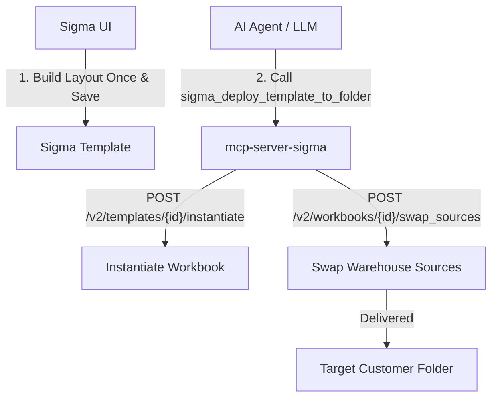

# 🚀 mcp-server-sigma

[](https://github.com/christianclaudio/mcp-server-sigma/actions/workflows/ci.yml)
[](https://pypi.org/project/mcp-server-sigma/)
[](https://pypi.org/project/mcp-server-sigma/)
[](https://github.com/christianclaudio/mcp-server-sigma/blob/main/LICENSE)
[](https://github.com/christianclaudio/mcp-server-sigma)
[](https://coderabbit.ai)

> **Supercharge your AI Agents with native Sigma Computing superpowers!** ⚡  
> An enterprise-grade Model Context Protocol (MCP) server with **155 tools covering connections**, workbooks, data models, members, teams, deployments, webhooks, multi-tenant operations, and composite workflow recipes straight to your favorite AI assistant.

---

## ⚠️ Disclaimers & Safety Warnings

> [!IMPORTANT]
> **Community Project Disclaimer**  
> `mcp-server-sigma` is an independent open-source community project. It is **not** affiliated with, sponsored by, endorsed by, or supported by Sigma Computing, Inc. *"Sigma Computing"* is a trademark of Sigma Computing, Inc.

> [!WARNING]
> **Credentials & Safety Notice**  
> This server uses API credentials scoped to your Sigma organization. Tools can mutate workbooks, users, teams, and data models.  
> - **Read-Only Mode:** To run safely without mutation risk, set `SIGMA_MCP_READONLY=1` (grants 83 read-only tools).  
> - **Destructive Safety Gates:** All single-delete tools require explicit `confirm=True`. Bulk destructive operations (`sigma_bulk_deactivate_members`, `sigma_bulk_remove_team_members`) are disabled by default and require `SIGMA_MCP_ALLOW_BULK_DESTRUCTIVE=1`.  
> - Read [SECURITY.md](https://github.com/christianclaudio/mcp-server-sigma/blob/main/SECURITY.md) before deploying to production.

---

## 💡 Why This Exists

Sigma Computing has a unique architectural asymmetry that shapes how you automate it:

1. **Data Models are 100% Code-Representable:** You can programmatically construct data models, define columns, joins, and SQL logic, update JSON specs, and swap warehouse sources via API.
2. **Workbook Layouts are primarily UI-driven:** While Sigma has introduced Beta endpoints for workbook specifications (`/v2/workbooks/spec`), programmatically constructing layout elements from scratch remains highly complex. 

The canonical path to automated BI dashboards is:  
**Build the layout once in the Sigma UI, save it as a template, then instantiate and source-swap it programmatically forever after!** 🎨 ➡️ 🤖

Our composite recipe tools (like `sigma_deploy_template_to_folder` and `sigma_swap_workbook_sources`) automate this exact pattern in a single MCP tool call (returning structured step progress or partial failure details if an intermediate step fails):



---

## 📦 Quickstart & Installation

### 1. Install via `pip` or `uv`

```bash
pip install mcp-server-sigma
# or with uv
uv pip install mcp-server-sigma
```

### Or run via Docker

```bash
docker run --rm -i --env-file .env \
  ghcr.io/christianclaudio/mcp-server-sigma:latest
```

### 2. Set Environment Variables

```bash
export SIGMA_CLIENT_ID="your-client-id"
export SIGMA_CLIENT_SECRET="your-client-secret"
export SIGMA_API_BASE_URL="https://api.us-a.aws.sigmacomputing.com"
```

> [!TIP]
> Use the API base URL assigned to your organization's region.

| Region | Base URL |
|--------|----------|
| **AWS US East** | `https://api.us-a.aws.sigmacomputing.com` |
| **AWS US West** | `https://aws-api.sigmacomputing.com` |
| **AWS Canada** | `https://api.ca.aws.sigmacomputing.com` |
| **AWS EU** | `https://api.eu.aws.sigmacomputing.com` |
| **AWS UK** | `https://api.uk.aws.sigmacomputing.com` |
| **AWS Australia** | `https://api.au.aws.sigmacomputing.com` |
| **Azure US** | `https://api.us.azure.sigmacomputing.com` |
| **Azure EU** | `https://api.eu.azure.sigmacomputing.com` |
| **Azure Canada** | `https://api.ca.azure.sigmacomputing.com` |
| **Azure UK** | `https://api.uk.azure.sigmacomputing.com` |
| **Azure Australia** | `https://api.au.azure.sigmacomputing.com` |
| **GCP US** | `https://api.sigmacomputing.com` |
| **GCP Saudi Arabia** | `https://api.sa.gcp.sigmacomputing.com` |

---

## 🔌 Integration Guides for AI Assistants & IDEs

`mcp-server-sigma` works seamlessly with all major AI assistants, IDEs, and CLI tools via standard `stdio` or `streamable-http`.

<details open>
<summary><b>🧡 Claude Desktop & Claude Code</b></summary>

Add to `~/Library/Application Support/Claude/claude_desktop_config.json` (macOS) or `%APPDATA%\Claude\claude_desktop_config.json` (Windows):

```json
{
  "mcpServers": {
    "sigma": {
      "command": "sigma-mcp",
      "env": {
        "SIGMA_CLIENT_ID": "your-client-id",
        "SIGMA_CLIENT_SECRET": "your-client-secret",
        "SIGMA_API_BASE_URL": "https://api.us-a.aws.sigmacomputing.com"
      }
    }
  }
}
```

For **Claude Code CLI**:
```bash
claude mcp add sigma -- sigma-mcp
```
</details>

<details>
<summary><b>♊ Google Antigravity & Gemini CLI</b></summary>

Add to your project's `.agents/mcp_config.json` (or global `~/.gemini/config/mcp_config.json`):

```json
{
  "mcpServers": {
    "sigma": {
      "command": "sigma-mcp",
      "args": [],
      "env": {
        "SIGMA_CLIENT_ID": "your-client-id",
        "SIGMA_CLIENT_SECRET": "your-client-secret",
        "SIGMA_API_BASE_URL": "https://api.us-a.aws.sigmacomputing.com"
      }
    }
  }
}
```
</details>

<details>
<summary><b>🤖 OpenAI Codex & Local HTTP Clients</b></summary>

Run in network transport mode (Streamable HTTP) for local CLI & agent extensions:

```bash
# Source environment variables from a protected file or secret manager
source .env

# Launch server on HTTP localhost port 8000 for local clients
sigma-mcp --transport streamable-http --host 127.0.0.1 --port 8000
```

Point your local Codex / HTTP SSE client to `http://127.0.0.1:8000/sse`.

*Note for hosted ChatGPT Actions or Custom GPTs:* Hosted cloud services cannot reach `localhost`. Place an authenticating HTTPS proxy (e.g., ngrok, Cloudflare Tunnel, or Caddy with TLS and Auth) in front of the server before connecting cloud services.
</details>

<details>
<summary><b>⚡ VS Code (Cline, Roo Code, GitHub Copilot Agent Mode, Continue)</b></summary>

#### Cline / Roo Code Settings (`cline_mcp_settings.json`):
```json
{
  "mcpServers": {
    "sigma": {
      "command": "sigma-mcp",
      "env": {
        "SIGMA_CLIENT_ID": "your-client-id",
        "SIGMA_CLIENT_SECRET": "your-client-secret",
        "SIGMA_API_BASE_URL": "https://api.us-a.aws.sigmacomputing.com"
      }
    }
  }
}
```

#### Continue.dev Config (`~/.continue/config.yaml`):
```yaml
mcpServers:
  - name: sigma
    command: sigma-mcp
    env:
      SIGMA_CLIENT_ID: "your-client-id"
      SIGMA_CLIENT_SECRET: "your-client-secret"
      SIGMA_API_BASE_URL: "https://api.us-a.aws.sigmacomputing.com"
```
</details>

<details>
<summary><b>🐙 GitHub Copilot CLI & Workspace Agent</b></summary>

Add `.github/mcp.json` to your repository:

```json
{
  "mcpServers": {
    "sigma": {
      "type": "local",
      "command": "sigma-mcp",
      "env": {
        "SIGMA_CLIENT_ID": "${COPILOT_MCP_SIGMA_CLIENT_ID}",
        "SIGMA_CLIENT_SECRET": "${COPILOT_MCP_SIGMA_CLIENT_SECRET}",
        "SIGMA_API_BASE_URL": "https://api.us-a.aws.sigmacomputing.com",
        "SIGMA_MCP_READONLY": "1"
      },
      "tools": ["sigma_get_workbook", "sigma_list_workbooks", "sigma_get_data_model"]
    }
  }
}
```

*Note for Copilot Cloud Agents:* Cloud code-review integrations must be configured through Repository Settings > Copilot > MCP servers instead.
</details>

<details>
<summary><b>❄️ Cortex Code (Snowflake / Enterprise CLI)</b></summary>

Add directly via the Cortex CLI:

```bash
cortex mcp add sigma-tools -- sigma-mcp
```
</details>

---

## 🛡️ Safety & Security Controls

Configure behavior using environment variables:

| Variable | Default | Description |
|----------|---------|-------------|
| `SIGMA_CLIENT_ID` | *Required* | Your Sigma API client ID. |
| `SIGMA_CLIENT_SECRET` | *Required* | Your Sigma API client secret. |
| `SIGMA_API_BASE_URL` | *Required* | Region-specific Sigma API host URL. |
| `SIGMA_MCP_PROFILE` | `full` | Tool registration subset: `core` (38 tools), `admin` (54), `embed` (57), `full` (155). |
| `SIGMA_MCP_READONLY` | `0` | Set `1` to register **only** read-only tools (83 tools). Models cannot alter org state. |
| `SIGMA_MCP_ALLOW_BULK_DESTRUCTIVE` | `0` | Set `1` to enable bulk deactivate/remove operations (`sigma_bulk_deactivate_members`, `sigma_bulk_remove_team_members`) (157 total). |
| `SIGMA_ALLOWED_TENANTS` | `""` | Comma-separated allowlist of tenant org IDs permitted for RFC 8693 token exchange. |
| `SIGMA_STRICT_TENANT_ALLOWLIST` | `0` | Set `1` to fail closed (HTTP 403) if a tenant request is made without an explicit allowlist entry. |
| `SIGMA_MCP_LOG_FORMAT` | `text` | Set `json` for structured JSON logging with duration metrics (`duration_ms`). |

---

## 📊 Feature & Tool Summary

The server registers **155 tools by default** across the following domain modules:

| Domain | Tools | Key Capabilities |
|--------|-------|------------------|
| **Workbooks** | 33 | CRUD, pages, elements, columns, queries, sources, swap, lineage, exports, materializations, bookmarks, tags, grants, embeds |
| **Reports** | 13 | CRUD, elements, queries, lineage, exports, schedules, sources, duplication |
| **Data Models** | 10 | CRUD, JSON spec inspection & editing, elements, columns, sources, swap, lineage, tags |
| **Members** | 10 | List, get, create, update, deactivate, teams, bulk deactivate, email change, onboarding |
| **Teams** | 10 | List, get, create, delete, members, bulk assign/remove, user attributes |
| **Connections** | 7 | List, get, schema sync, connectivity test, columns, grants |
| **Multi-Tenant** | 6 | List tenants, tenant info, capabilities, cross-tenant connection sync |
| **Deployments** | 6 | List, get, create, add documents, archive |
| **Templates** | 6 | List, get, instantiate, save from workbook, swap sources, shared templates |
| **Workspaces** | 6 | List, get, create, delete, grants |
| **User Attributes** | 9 | CRUD, user/team/tenant value assignments |
| **Webhooks** | 6 | Webhook subscription management, payload signature validation, event history |
| **Grants** | 5 | Access control lists, workbook/workspace/connection grants |
| **Files & Folders** | 4 | Inode search, create folder, update, delete |
| **Tags** | 4 | List, create, tag workbook, tag data model |
| **Reference** | 4 | `sigma_api_capabilities`, `sigma_formula_pitfalls`, `sigma_search_docs`, `sigma_get_doc_page` |
| **Composite Recipes** | 14 | High-level multi-step workflow recipes |

*Note: Domain categories overlap slightly. The 2 bulk-destructive tools (`sigma_bulk_deactivate_members`, `sigma_bulk_remove_team_members`) are excluded by default and bring the total to 157 when enabled.*

---

## 🍳 Composite Workflow Recipes

These high-level tools bundle multi-step API sequences into a single atomic call:

| Recipe Tool | What It Does |
|-------------|--------------|
| `sigma_deploy_template_to_folder` | Instantiates a template & swaps warehouse sources in 1 call |
| `sigma_materialize_and_wait` | Triggers a data materialization and polls until complete with timeout |
| `sigma_onboard_member` | Atomically creates a member and assigns them to multiple teams |
| `sigma_bulk_assign_team_members` | Batch-adds $N$ members to a team in a single request |
| `sigma_bulk_remove_team_members` | Resolves member emails and batch-removes them from a team |
| `sigma_bulk_deactivate_members` | Regex-matches members, generates dry-run report, and deactivates |
| `sigma_bulk_sync_tenant_connections` | Performs RFC 8693 token exchange per tenant to sync all connections |
| `sigma_copy_workbook_to_member` | Duplicates a workbook directly into a user's home folder |
| `sigma_promote_workbook` | Tags a workbook for version promotion (creates tag if missing) |
| `sigma_export_and_download` | Exports workbook/element, handles 204 polling, returns final content |
| `sigma_sync_all_tables_in_schema` | Syncs an entire database.schema path across Sigma connections |
| `sigma_reassign_workbook_ownership` | Bulk-transfers workbook ownership from one member email to another |

---

## 📐 MCP 2.0 Hints & Safety Annotations

Every tool includes structured MCP hints to assist AI clients with user permission prompts:

| Annotation | Count | Meaning |
|------------|-------|---------|
| `readOnlyHint=true` | 83 | Indicates intended non-mutation; clients may still require explicit user approval |
| `destructiveHint=true` | 16 | Deletes, deactivates, or revokes; clients should prompt |
| `idempotentHint=true` | 8 | Safe to retry; same input = same outcome |
| `openWorldHint=true` | 155 | All tools hit an external API |

---

## 🧮 Writing Sigma Formulas

AI models frequently hallucinate SQL or Excel functions when writing Sigma formulas (e.g. using `ArrayAgg()` instead of `List()`).  
Before writing any Sigma formula, call the built-in reference tool:

```bash
# Model prompt helper
Use tool `sigma_formula_pitfalls` to check formula syntax rules.
```

See [docs/formulas.md](https://github.com/christianclaudio/mcp-server-sigma/blob/main/docs/formulas.md) for full syntax details.

---

## 👩‍💻 Local Development & Testing

```bash
# Install dev tools
pip install -e ".[dev]"

# Run full test suite with 100% statement line coverage enforcement
pytest --cov=src/sigma_mcp --cov-fail-under=100 --cov-report=term-missing

# Run OpenAPI drift check
python scripts/check_openapi_drift.py

# Run MCP tool contract validation
python scripts/check_tool_contract.py

# Code formatting & type checking
ruff check src/
ruff format --check .
mypy --strict src/
```

> [!NOTE]
> **Automated Drift Checks**: This repository runs a weekly scheduled GitHub Action (`sigma-drift-monitor.yml`) that compares client methods against the live Sigma OpenAPI specification. If drift is detected, the workflow automatically opens an issue in the repository.

---

## 🤝 Contributing & Community

Contributions are welcome! Please read [CONTRIBUTING.md](https://github.com/christianclaudio/mcp-server-sigma/blob/main/CONTRIBUTING.md) for development rules, [SECURITY.md](https://github.com/christianclaudio/mcp-server-sigma/blob/main/SECURITY.md) for security reporting, and [CODE_OF_CONDUCT.md](https://github.com/christianclaudio/mcp-server-sigma/blob/main/CODE_OF_CONDUCT.md) for community standards.

---

## 📜 License

[MIT License](https://github.com/christianclaudio/mcp-server-sigma/blob/main/LICENSE).  
Copyright (c) 2026 Christian Claudio.

*Disclaimer: Not affiliated with, sponsored by, or endorsed by Sigma Computing, Inc.*

<!-- mcp-name: io.github.christianclaudio/sigma -->
