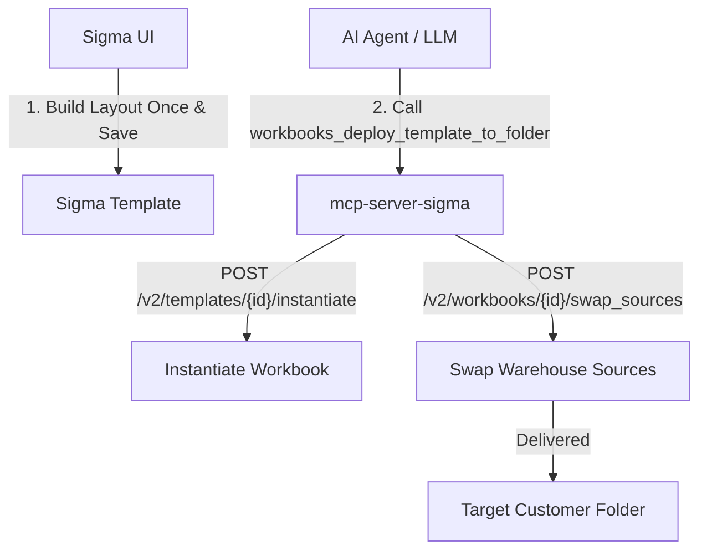

# 📊 mcp-server-sigma

[](https://github.com/christianclaudio/mcp-server-sigma/actions/workflows/ci.yml)
[](https://pypi.org/project/mcp-server-sigma/)
[](https://pypi.org/project/mcp-server-sigma/)
[](https://opensource.org/licenses/Apache-2.0)
[](https://github.com/christianclaudio/mcp-server-sigma)
[](https://coderabbit.ai)

> **Supercharge your AI Agents with native Sigma Computing superpowers!** ⚡  
> An enterprise-grade Model Context Protocol (MCP) server with **172 tools covering connections**, workbooks, data models, members, teams, deployments, webhooks, multi-tenant operations, and composite workflow recipes straight to your favorite AI assistant.

---

## ⚠️ Disclaimers & Safety Warnings

> [!IMPORTANT]
> **Community Project Disclaimer**  
> `mcp-server-sigma` is an independent open-source community project. It is **not** affiliated with, sponsored by, endorsed by, or supported by Sigma Computing, Inc. *"Sigma Computing"* is a trademark of Sigma Computing, Inc.

> [!WARNING]
> **Credentials & Safety Notice**  
> This server uses API credentials scoped to your Sigma organization. Tools can mutate workbooks, users, teams, and data models.  
> - **Read-Only Mode:** To run safely without mutation risk, set `SIGMA_MCP_READONLY=1` or `--profile readonly` (lists the 90 tools annotated `readOnlyHint=true` and refuses every other call).  
> - **Destructive Safety Gates:** All single-delete tools require explicit `confirm=True`; without it they change nothing and return a normal result (`isError: false`) asking the caller to re-call with `confirm=true`. Missing or invalid arguments return a tool error (`isError: true`) the model can correct, and so do other failed calls such as a member not found, an export that times out, or a rejected bulk-deactivate pattern (see [docs/errors.md](docs/errors.md)). A batch tool whose every item failed returns `isError: true` with `"type": "batch_failed"`; a partial success stays a normal result with `"status": "partial_success"`, a `<verb>_count`, `failed_count`, `results` and `errors`, where each entry has `id`, `status` and `result` or `error`, alongside the field names each tool returned before; failed items that earlier releases listed in `results` are still there too (see [docs/errors.md](docs/errors.md)). Bulk destructive operations (`admin_bulk_deactivate_members`, `admin_bulk_remove_team_members`) are listed in `full` but refused at call time unless `SIGMA_MCP_ALLOW_BULK_DESTRUCTIVE=1`.  
> - Read [SECURITY.md](https://github.com/christianclaudio/mcp-server-sigma/blob/main/SECURITY.md) before deploying to production.

---

## 💡 Why This Exists

Sigma Computing has a unique architectural asymmetry that shapes how you automate it:

1. **Data Models are 100% Code-Representable:** You can programmatically construct data models, define columns, joins, and SQL logic, update JSON specs, and swap warehouse sources via API.
2. **Workbook Layouts are primarily UI-driven:** While Sigma has introduced Beta endpoints for workbook specifications (`/v2/workbooks/spec`), programmatically constructing layout elements from scratch remains highly complex. 

The canonical path to automated BI dashboards is:  
**Build the layout once in the Sigma UI, save it as a template, then instantiate and source-swap it programmatically forever after!** 🎨 ➡️ 🤖

Our composite recipe tools (like `workbooks_deploy_template_to_folder` and `elements_swap_workbook_sources`) automate this exact pattern in a single MCP tool call (returning structured step progress or partial failure details if an intermediate step fails):


```mermaid
graph TD
    UI["Sigma UI"] -->|"1. Build Layout Once & Save"| TPL["Sigma Template"]
    Agent["AI Agent / LLM"] -->|"2. Call workbooks_deploy_template_to_folder"| MCP["mcp-server-sigma"]
    MCP -->|"POST /v2/templates/{id}/instantiate"| API1["Instantiate Workbook"]
    MCP -->|"POST /v2/workbooks/{id}/swap_sources"| API2["Swap Warehouse Sources"]
    API2 -->|"Delivered"| Dest["Target Customer Folder"]
```

---

## 📦 Quickstart & Installation

### 1. Install via `pip` or `uv`

```bash
pip install mcp-server-sigma
# or with uv
uv pip install mcp-server-sigma
```

### Or run via Docker

```bash
docker run --rm -i --env-file .env \
  ghcr.io/christianclaudio/mcp-server-sigma:latest
```

The image's default command is stdio. To serve Streamable HTTP from the container, bind `0.0.0.0` inside it and pass a token. Keep the token off the command line (it shows up in shell history and `ps`): put `SIGMA_MCP_AUTH_TOKEN` in `.env`, or export it and pass the name alone with `-e`:

```bash
export SIGMA_MCP_AUTH_TOKEN="$(openssl rand -hex 32)"  # or read it from your secret store
docker run --rm -p 8000:8000 --env-file .env \
  -e SIGMA_MCP_AUTH_TOKEN \
  ghcr.io/christianclaudio/mcp-server-sigma:latest \
  --transport streamable-http --host 0.0.0.0 --port 8000 --allowed-host mcp.example.com
```

### 2. Set Environment Variables

```bash
export SIGMA_CLIENT_ID="your-client-id"
export SIGMA_CLIENT_SECRET="your-client-secret"
export SIGMA_API_BASE_URL="https://api.us-a.aws.sigmacomputing.com"
```

> [!TIP]
> Use the API base URL assigned to your organization's region.

| Region | Base URL |
|--------|----------|
| **AWS US East** | `https://api.us-a.aws.sigmacomputing.com` |
| **AWS US West** | `https://aws-api.sigmacomputing.com` |
| **AWS Canada** | `https://api.ca.aws.sigmacomputing.com` |
| **AWS EU** | `https://api.eu.aws.sigmacomputing.com` |
| **AWS UK** | `https://api.uk.aws.sigmacomputing.com` |
| **AWS Australia** | `https://api.au.aws.sigmacomputing.com` |
| **Azure US** | `https://api.us.azure.sigmacomputing.com` |
| **Azure EU** | `https://api.eu.azure.sigmacomputing.com` |
| **Azure Canada** | `https://api.ca.azure.sigmacomputing.com` |
| **Azure UK** | `https://api.uk.azure.sigmacomputing.com` |
| **Azure Australia** | `https://api.au.azure.sigmacomputing.com` |
| **GCP US** | `https://api.sigmacomputing.com` |
| **GCP Saudi Arabia** | `https://api.sa.gcp.sigmacomputing.com` |

---

## 🔌 Integration Guides for AI Assistants & IDEs

`mcp-server-sigma` works seamlessly with all major AI assistants, IDEs, and CLI tools via standard `stdio` or `streamable-http`.

<details open>
<summary><b>🧡 Claude Desktop & Claude Code</b></summary>

Add to `~/Library/Application Support/Claude/claude_desktop_config.json` (macOS) or `%APPDATA%\Claude\claude_desktop_config.json` (Windows):

```json
{
  "mcpServers": {
    "sigma": {
      "command": "sigma-mcp",
      "env": {
        "SIGMA_CLIENT_ID": "your-client-id",
        "SIGMA_CLIENT_SECRET": "your-client-secret",
        "SIGMA_API_BASE_URL": "https://api.us-a.aws.sigmacomputing.com"
      }
    }
  }
}
```

For **Claude Code CLI**:
```bash
claude mcp add sigma -- sigma-mcp
```
</details>

<details>
<summary><b>♊ Google Antigravity & Gemini CLI</b></summary>

Add to your project's `.agents/mcp_config.json` (or global `~/.gemini/config/mcp_config.json`):

```json
{
  "mcpServers": {
    "sigma": {
      "command": "sigma-mcp",
      "args": [],
      "env": {
        "SIGMA_CLIENT_ID": "your-client-id",
        "SIGMA_CLIENT_SECRET": "your-client-secret",
        "SIGMA_API_BASE_URL": "https://api.us-a.aws.sigmacomputing.com"
      }
    }
  }
}
```
</details>

<details>
<summary><b>🤖 OpenAI Codex & Local HTTP Clients</b></summary>

Run in network transport mode (Streamable HTTP) for local CLI & agent extensions:

```bash
# Source environment variables from a protected file or secret manager
source .env

# Launch server on HTTP localhost port 8000 for local clients
sigma-mcp --transport streamable-http --host 127.0.0.1 --port 8000
```

Point your local Codex / Streamable HTTP client to `http://127.0.0.1:8000/mcp`. When `SIGMA_MCP_AUTH_TOKEN` is set, the client must send `Authorization: Bearer <token>`; requests without it, or with a different token, get HTTP 401.

HTTP transports follow the MCP guidance that a local server binds to localhost, and require a bearer token whenever the server is reachable beyond it:

* On `127.0.0.1`, `::1` or `localhost` (the `--host` default is `127.0.0.1`), HTTP runs with or without `SIGMA_MCP_AUTH_TOKEN`; without it, a warning says requests are not authenticated.
* On any other host (`0.0.0.0`, `::`, a LAN address), the server refuses to start (exit code 2) unless `SIGMA_MCP_AUTH_TOKEN` is set, or `SIGMA_MCP_ALLOW_UNAUTHENTICATED_BIND=1` accepts an unauthenticated bind (logged as a warning), for example behind a gateway that authenticates for you.
* The token is attached when the server is built, so `fastmcp run src/sigma_mcp/server.py:mcp --transport http` and an ASGI host mounting `mcp.http_app()` enforce it too. Those entry points do not know the bind host, so they cannot refuse a public bind; use `sigma-mcp` for that policy.
* In the default (stateful) HTTP mode, a session idle for 30 minutes expires: its next request gets HTTP 404 and the client must start a new session. Change this with FastMCP's `session_idle_timeout` (on `http_app()`) or `FASTMCP_HTTP_SESSION_IDLE_TIMEOUT` (seconds, or `none` to never expire); see the [FastMCP 4.1.0 release](https://github.com/PrefectHQ/fastmcp/releases/tag/v4.1.0) and [#5229](https://github.com/PrefectHQ/fastmcp/pull/5229).

*Note for hosted ChatGPT Actions or Custom GPTs:* Hosted cloud services cannot reach `localhost`. Place an authenticating HTTPS proxy (e.g., ngrok, Cloudflare Tunnel, or Caddy with TLS and Auth) in front of the server before connecting cloud services.
</details>

<details>
<summary><b>⚡ VS Code (Cline, Roo Code, GitHub Copilot Agent Mode, Continue)</b></summary>

#### Cline / Roo Code Settings (`cline_mcp_settings.json`):
```json
{
  "mcpServers": {
    "sigma": {
      "command": "sigma-mcp",
      "env": {
        "SIGMA_CLIENT_ID": "your-client-id",
        "SIGMA_CLIENT_SECRET": "your-client-secret",
        "SIGMA_API_BASE_URL": "https://api.us-a.aws.sigmacomputing.com"
      }
    }
  }
}
```

#### Continue.dev Config (`~/.continue/config.yaml`):
```yaml
mcpServers:
  - name: sigma
    command: sigma-mcp
    env:
      SIGMA_CLIENT_ID: "your-client-id"
      SIGMA_CLIENT_SECRET: "your-client-secret"
      SIGMA_API_BASE_URL: "https://api.us-a.aws.sigmacomputing.com"
```
</details>

<details>
<summary><b>💻 Cursor & Windsurf</b></summary>

Add to `~/.cursor/mcp.json`:

```json
{
  "mcpServers": {
    "sigma": {
      "command": "sigma-mcp",
      "env": {
        "SIGMA_CLIENT_ID": "your-client-id",
        "SIGMA_CLIENT_SECRET": "your-client-secret",
        "SIGMA_API_BASE_URL": "https://api.us-a.aws.sigmacomputing.com"
      }
    }
  }
}
```
</details>

<details>
<summary><b>🐙 GitHub Copilot CLI & Workspace Agent</b></summary>

Add `.github/mcp.json` to your repository:

```json
{
  "mcpServers": {
    "sigma": {
      "type": "local",
      "command": "sigma-mcp",
      "env": {
        "SIGMA_CLIENT_ID": "${COPILOT_MCP_SIGMA_CLIENT_ID}",
        "SIGMA_CLIENT_SECRET": "${COPILOT_MCP_SIGMA_CLIENT_SECRET}",
        "SIGMA_API_BASE_URL": "https://api.us-a.aws.sigmacomputing.com",
        "SIGMA_MCP_READONLY": "1"
      },
      "tools": ["workbooks_get_workbook", "workbooks_list_workbooks", "datasets_get_data_model"]
    }
  }
}
```

*Note for Copilot Cloud Agents:* Cloud code-review integrations must be configured through Repository Settings > Copilot > MCP servers instead.
</details>

<details>
<summary><b>❄️ Cortex Code (Snowflake / Enterprise CLI)</b></summary>

Add directly via the Cortex CLI:

```bash
cortex mcp add sigma-tools -- sigma-mcp
```
</details>

---

## 🛡️ Safety & Security Controls

Configure behavior using environment variables:

| Variable | Default | Description |
|----------|---------|-------------|
| `SIGMA_CLIENT_ID` | *Required* | Your Sigma API client ID. |
| `SIGMA_CLIENT_SECRET` | *Required* | Your Sigma API client secret. |
| `SIGMA_API_BASE_URL` | *Required* | Region-specific Sigma API host URL. Must be HTTPS and a host in `SIGMA_ALLOWED_HOSTS`. |
| `SIGMA_ALLOWED_HOSTS` | official regional API hosts | Comma-separated hostname allowlist for `SIGMA_API_BASE_URL` and `X-Sigma-Base-Url`. Unset or empty uses the official Sigma regional API hosts. Loopback, private, link-local, and cloud-metadata targets are always rejected. |
| `SIGMA_MCP_PROFILE` | `full` | Profile: `full`, `readonly`, `analyst`, `author`, `modeler`, `embed`, `access_admin` (see [Profiles](#-profiles)). An unknown value fails at startup. |
| `SIGMA_MCP_READONLY` | `0` | Set `1` to list **only** tools annotated `readOnlyHint=true` and refuse every other call (90 tools on `full`). Composes with any profile. |
| `SIGMA_MCP_ALLOW_BULK_DESTRUCTIVE` | `0` | Set `1` to let the two listed bulk tools (`admin_bulk_deactivate_members`, `admin_bulk_remove_team_members`) execute. Without it they are refused at call time. |
| `SIGMA_MCP_ENABLE_TOOL_SEARCH` | `0` | Set `1` (or `--enable-tool-search`) for Tool Search on `full` only. |
| `SIGMA_MCP_TOOL_SEARCH_BACKEND` | `regex` | Tool Search backend: `regex` or `bm25` (or `--tool-search-backend`). |
| `SIGMA_MCP_ENABLE_CODE_MODE` | `0` | Set `1` (or `--enable-code-mode`) for experimental Code Mode on `full` only; not with Tool Search. |
| `SIGMA_MCP_AUTH_TOKEN` | *(unset)* | On `streamable-http` and `sse`, requires `Authorization: Bearer <token>` on every MCP request (FastMCP server auth; a missing or wrong token gets HTTP 401). Leading and trailing whitespace is stripped; unset or blank: HTTP requests are not authenticated and the server logs a warning. Enforced on every HTTP entry point (`sigma-mcp`, `fastmcp run`, `http_app()`). Ignored on `stdio`. |
| `SIGMA_MCP_ALLOW_UNAUTHENTICATED_BIND` | `0` | Set to `1` (or `true`/`yes`/`on`) to let an HTTP transport bind a host other than `127.0.0.1`, `::1` or `localhost` with no token. Without it, such a bind exits at startup with code 2. |
| `SIGMA_ALLOWED_TENANTS` | `""` | Comma-separated allowlist of tenant org IDs permitted for RFC 8693 token exchange. |
| `SIGMA_STRICT_TENANT_ALLOWLIST` | `0` | Set `1` to fail closed (HTTP 403) if a tenant request is made without an explicit allowlist entry. |
| `SIGMA_MCP_LOG_FORMAT` | `text` | Set `json` for structured JSON logging with duration metrics (`duration_ms`). |

---

## 🧭 Profiles

Pick a profile with `--profile` or `SIGMA_MCP_PROFILE` (default `full`). Every profile mounts all five domains (`workbooks`, `datasets`, `elements`, `workspace`, `admin`). Job profiles then expose only an explicit list of tool names for one job; prompts and resources stay available on every profile. Each listed name is checked against the full catalog when the server builds, so an unknown profile or a typo in a list fails at startup with `ValueError`.

| Profile | Job it serves | Tools | With `SIGMA_MCP_READONLY=1` |
| :--- | :--- | ---: | ---: |
| `full` | Complete catalog, nothing omitted. Bulk tools are listed and refused at call time unless `SIGMA_MCP_ALLOW_BULK_DESTRUCTIVE=1`. Tool Search and Code Mode attach only here. | **172** | 90 |
| `readonly` | Auditor / safe exploration: every tool annotated `readOnlyHint=true` across all mounts. | **90** | 90 |
| `analyst` | Business user finds, reads, exports and schedules workbooks and reports, bookmarks views, and asks workbook agents. | **31** | 23 |
| `author` | Workbook author builds, versions and verifies workbooks, reports and templates, and inspects elements while editing. | **40** | 28 |
| `modeler` | Data modeler maintains connections and data models, swaps workbook/report/model sources and materializes elements. | **33** | 24 |
| `embed` | Embedded-analytics engineer provisions tenants and tenant dashboards: templates, deployments, source swaps, embeds, tenant user attributes and connection syncs. | **50** | 27 |
| `access_admin` | Org admin onboards and offboards members, manages teams, grants and user attributes, workspace/workbook/connection access, and org security settings. | **52** | 22 |

Nine tools are in no job profile and are reachable only in `full`: `workspace_delete_file`, `workspace_update_file`, `workspace_create_tag`, `workspace_delete_tag`, `admin_list_translations`, `admin_bulk_deactivate_members`, `admin_bulk_remove_team_members`, `admin_api_capabilities`, and `admin_list_recent_webhooks`.

### Read-only behavior

* The MCP `readOnlyHint` annotation is the only thing that decides whether a tool is read-only. Every tool declares it explicitly: `true` on the 90 reads and `false` on the 82 writes. A tool with no annotation or no `readOnlyHint` counts as a write.
* `--profile readonly` or `SIGMA_MCP_READONLY=1` (on any profile) lists only the read-only tools, and `ReadOnlyGateMiddleware` refuses any call to a real tool that is not read-only, including a write the filter hid. A refusal comes back as a tool result with `isError: true`.
* A name that is not a tool on the server gets FastMCP's normal `Unknown tool` error, directly or through `call_tool`, so a typo is never reported as a blocked tool.
* With Tool Search on, the gate checks the tool that `call_tool` wraps. Reads through `call_tool` work and writes are refused. Without Tool Search, `call_tool` is not a tool on the server, so a call to it gets `Unknown tool: 'call_tool'`.
* If the gate cannot see the serving server, it refuses the call.

### Bulk gate

`admin_bulk_deactivate_members` and `admin_bulk_remove_team_members` are listed in `full`. The admin domain guard refuses them at call time (`isError: true`) unless `SIGMA_MCP_ALLOW_BULK_DESTRUCTIVE=1`, and the handlers keep their own `confirm` / `dry_run` safeguards. Read-only mode hides and refuses them.

### Tool Search and Code Mode

`tools/list` is flat by default. Discovery is opt-in and attaches **only on `full`**:

* `--enable-tool-search` / `SIGMA_MCP_ENABLE_TOOL_SEARCH=1` replaces `tools/list` with `search_tools` and `call_tool`. The backend is `regex` (default) or `bm25` (`--tool-search-backend` / `SIGMA_MCP_TOOL_SEARCH_BACKEND`).
* `--enable-code-mode` / `SIGMA_MCP_ENABLE_CODE_MODE=1` attaches FastMCP's experimental Code Mode (`search`, `get_schema`, `execute`). Code Mode needs the sandbox from the package's `code-mode` extra (`fastmcp[code-mode]`, which ships `pydantic-monty`): `pip install "mcp-server-sigma[code-mode]"` or `uvx "mcp-server-sigma[code-mode]" --enable-code-mode`. Without it, Code Mode is skipped with a warning and the flat catalog is served.
* Turning on both raises `ValueError`. Asking for either on another profile logs a warning and keeps the flat list.
* `search_tools`, `search` and `get_schema` only read the catalog and are annotated `readOnlyHint=true`. Under read-only, Code Mode `execute` is refused.

---

## 📊 Feature & Tool Summary

The `full` profile lists **172 tools**. Every tool name starts with the domain it is mounted under:

| Domain | Tools | Covers |
|--------|------:|--------|
| `workbooks` | 54 | Workbooks, reports and templates: contents/spec, pages, versions, bookmarks, schedules, exports, tags, grants, embeds, workbook agents, template deployment |
| `datasets` | 22 | Connections and data models: connection grants, tests and schema syncs, cross-tenant connection sync, data model specs, columns, lineage and source swaps |
| `elements` | 21 | Workbook elements, columns, controls, queries and sources; materializations; source-swap policies; Sigma docs search and formula reference |
| `workspace` | 15 | Workspaces and their grants, files and folders, tags |
| `admin` | 60 | Members, teams, user attributes, tenants, deployments, grants, org settings, AI config, IP allowlists, API connectors, recent webhook events |
| **Total** | **172** | |

`scripts/check_tool_contract.py` fails CI if these counts drift from the live registry. The 2 bulk-destructive tools (`admin_bulk_deactivate_members`, `admin_bulk_remove_team_members`) are in the `admin` count and are refused at call time unless `SIGMA_MCP_ALLOW_BULK_DESTRUCTIVE=1`.

---

## 🍳 Composite Workflow Recipes

These high-level tools bundle multi-step API sequences into a single atomic call:

| Recipe Tool | What It Does |
|-------------|--------------|
| `workbooks_deploy_template_to_folder` | Instantiates a template & swaps warehouse sources in 1 call |
| `elements_materialize_and_wait` | Triggers a data materialization and polls until complete with timeout |
| `admin_onboard_member` | Atomically creates a member and assigns them to multiple teams |
| `admin_bulk_assign_team_members` | Batch-adds $N$ members to a team in a single request |
| `admin_bulk_remove_team_members` | Resolves member emails and batch-removes them from a team |
| `admin_bulk_deactivate_members` | Regex-matches members, generates dry-run report, and deactivates |
| `datasets_bulk_sync_tenant_connections` | Performs RFC 8693 token exchange per tenant to sync all connections |
| `workbooks_copy_workbook_to_member` | Duplicates a workbook directly into a user's home folder |
| `workbooks_promote_workbook` | Tags a workbook for version promotion (creates tag if missing) |
| `workbooks_export_and_download` | Exports workbook/element, handles 204 polling, returns final content |
| `datasets_sync_all_tables_in_schema` | Syncs an entire database.schema path across Sigma connections |
| `workbooks_reassign_workbook_ownership` | Bulk-transfers workbook ownership from one member email to another |

---

## 📐 MCP 2.0 Hints & Safety Annotations

Every tool includes structured MCP hints to assist AI clients with user permission prompts:

| Annotation | Count | Meaning |
|------------|-------|---------|
| `readOnlyHint=true` | 90 | Indicates intended non-mutation; clients may still require explicit user approval |
| `destructiveHint=true` | 20 | Deletes, deactivates, or revokes; clients should prompt |
| `idempotentHint=true` | 8 | Safe to retry; same input = same outcome |
| `openWorldHint=true` | 172 | All tools hit an external API |

---

## 🧮 Writing Sigma Formulas

AI models frequently hallucinate SQL or Excel functions when writing Sigma formulas (e.g. using `ArrayAgg()` instead of `List()`).  
Before writing any Sigma formula, call the built-in reference tool:

```bash
# Model prompt helper
Use tool `elements_formula_pitfalls` to check formula syntax rules.
```

See [docs/formulas.md](https://github.com/christianclaudio/mcp-server-sigma/blob/main/docs/formulas.md) for full syntax details.

---

## 👩‍💻 Local Development & Testing

```bash
# Install dev tools
pip install -e ".[dev]"

# Run full test suite with 100% statement line coverage enforcement
pytest --cov=src/sigma_mcp --cov-fail-under=100 --cov-report=term-missing

# Run OpenAPI drift check
python scripts/check_openapi_drift.py

# Run MCP tool contract validation
python scripts/check_tool_contract.py

# Code formatting & type checking
ruff check src/
ruff format --check .
mypy --strict src/
```

> [!NOTE]
> **Automated Drift Checks**: This repository runs a weekly scheduled GitHub Action (`sigma-drift-monitor.yml`) that compares client methods against the live Sigma OpenAPI specification. If drift is detected, the workflow automatically opens an issue in the repository.

---

## 🤝 Contributing & Community

Contributions are welcome! Please read [CONTRIBUTING.md](https://github.com/christianclaudio/mcp-server-sigma/blob/main/CONTRIBUTING.md) for development rules, [SECURITY.md](https://github.com/christianclaudio/mcp-server-sigma/blob/main/SECURITY.md) for security reporting, and [CODE_OF_CONDUCT.md](https://github.com/christianclaudio/mcp-server-sigma/blob/main/CODE_OF_CONDUCT.md) for community standards.

---

## 📜 License

[MIT License](https://github.com/christianclaudio/mcp-server-sigma/blob/main/LICENSE).  
Copyright (c) 2026 Christian Claudio.

*Disclaimer: Not affiliated with, sponsored by, or endorsed by Sigma Computing, Inc.*

<!-- mcp-name: io.github.christianclaudio/sigma -->
